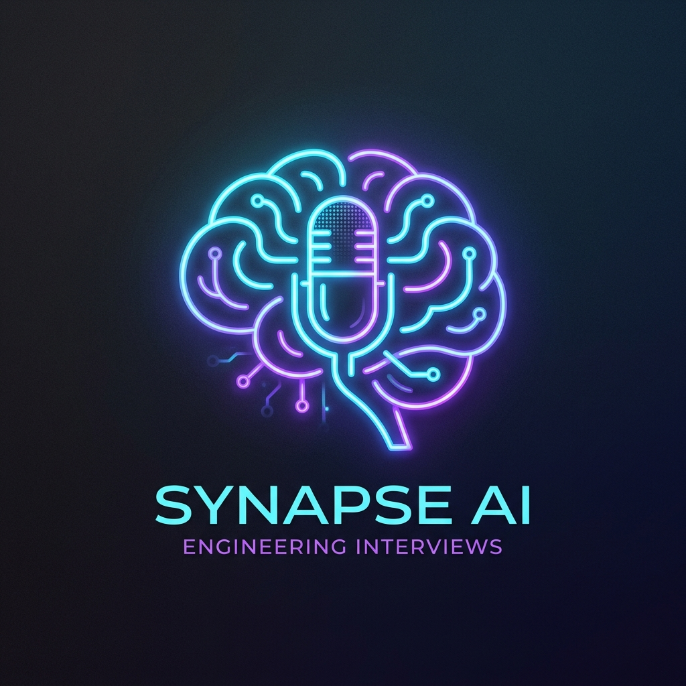

<div align="center">
  
  
  # AutoHire: Autonomous Engineering Interview Platform
  
  An advanced, AI-driven interviewing platform engineered to simulate real-world technical interviews with complete autonomy. AutoHire evaluates software engineers dynamically through voice interactions, providing real-time feedback, deep technical probing, and strict competency mapping.

  [](https://nextjs.org/)
  [](https://fastapi.tiangolo.com/)
  [](https://langchain.com/)
  [](https://tailwindcss.com/)
</div>

---

## Executive Summary

Traditional technical screening is resource-intensive, difficult to scale, and susceptible to unconscious human bias. **AutoHire** addresses these systemic challenges by deploying a specialized, adaptive AI agent (powered by LLMs like LLaMA-3 via Groq and Gemini) that interacts with candidates exactly as a Senior Engineering Manager would.

The system evaluates candidates strictly across Technical Depth, Software Architecture, Problem Solving, and Communication Skills, concluding with an unbiased, data-backed recommendation.

---

## Core Features

- **Voice & Text Modalities**: Candidates converse naturally with the system. It handles real-time Speech-to-Text and responds with high-fidelity Text-to-Speech (Edge TTS), maintaining conversational flow.
- **Zero-Latency Booting**: To ensure a frictionless candidate experience, background subagents concurrently scrape the web to fetch role-specific constraints and context while the candidate reviews the setup screen.
- **Real-Time Competency Tracking**: Leveraging stateful WebSockets, the platform evaluates each response in milliseconds. The UI dynamically updates progress bars reflecting specific engineering competencies as the interview progresses.
- **Dynamic Session Constraints**: The system supports flexible limits configured either by strict Question Counts or exact Time Limits, adapting seamlessly to the hiring pipeline's requirements.
- **Bilingual Interface**: Seamless switching between English (LTR) and Arabic (RTL) across the entire UI and the AI Voice Persona, enabling localized hiring.
- **Anti-Cheat Mechanics**: Integrates strict client-side tracking for tab-switching and focus loss, which automatically flags the final scorecard to preserve assessment integrity.
- **Comprehensive Scorecard Generation**: Upon session completion, the platform generates a beautifully structured, downloadable PDF scorecard containing competency radar charts, key strengths, weaknesses, and a strict final hiring recommendation.

---

## System Architecture

The platform is designed around a modern, decoupled architecture prioritizing low latency and maintainability.

1. **Frontend (Next.js 15, React 19, Tailwind CSS v4):** 
   - A minimalist, accessibility-focused UI supporting dark and light themes.
   - Built-in data visualization using Recharts.
   - Custom React Hooks engineered for seamless audio streaming, recording, and WebSocket state management.

2. **Backend (FastAPI, Python, LangChain, LangGraph):**
   - Asynchronous WebSocket endpoints managing the complex interview state machine.
   - A Multi-Agent workflow orchestrating three distinct LLM roles:
     - **The Interviewer**: Drives the conversation, asks adaptive questions, and probes for deeper technical understanding.
     - **The Live Evaluator**: Scores individual responses in real-time without blocking the primary conversational loop.
     - **The Assessor**: Strictly grades the complete transcript at the end, enforcing a rigorous rubric.

---

## Local Development & Setup

### Prerequisites
- Node.js 18+
- Python 3.11+
- API Keys for Groq and Google Generative AI (Gemini).

### 1. Repository Setup
```bash
git clone https://github.com/your-username/ai-automation-interview.git
cd ai-automation-interview
```

### 2. Backend Initialization (FastAPI)
```bash
cd backend
python -m venv .venv

# Windows
.venv\Scripts\activate
# Mac/Linux
source .venv/bin/activate

pip install -r requirements.txt

# Environment Configuration
echo "GROQ_API_KEY=your_groq_key" > .env
echo "GEMINI_API_KEY=your_gemini_key" >> .env

# Start the server
uvicorn app.main:app --port 8000 --reload
```

### 3. Frontend Initialization (Next.js)
Open a new terminal window:
```bash
cd frontend
npm install
npm run dev
```
Navigate to `http://localhost:3000` to launch the application.

---

## Deployment Strategy

- **Frontend (Vercel):** The application is optimized for Edge deployment. It can be deployed instantly using the Vercel CLI (`npx vercel` inside the `frontend` directory).
- **Backend (Render):** A robust `render.yaml` and `Dockerfile` are included for streamlined, 1-click containerized deployment on Render.com.

---

## Assessment Integrity & Security

- **Data Minimization**: Interview transcripts are stored strictly in-memory during the session and are discarded upon completion, ensuring compliance with data privacy standards.
- **Evaluation Strictness**: The evaluation agents are heavily prompted to apply rigorous standards. Blank audio, skipped questions, or superficial answers automatically result in zero scores to prevent hallucinated positive feedback.

---

<div align="center">
  <i>Engineered to bring objectivity and scale to technical hiring.</i>
</div>
