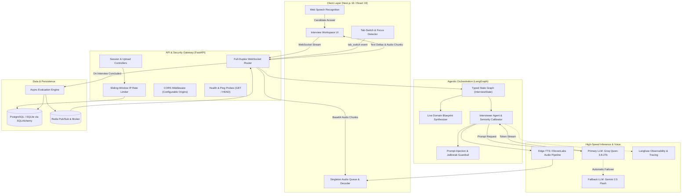

# AutoHire: Autonomous Multimodal Technical Interview System

AutoHire is a production-grade, real-time autonomous technical interviewer engineered to conduct rigorous, multi-modal engineering assessments. Built on LangGraph state machines, ultra-low-latency LLM inference (Groq Qwen-3.8-27b with Google Gemini Flash fallback), full-duplex WebSockets, and asynchronous evaluation pipelines, the platform mirrors an engineering lead assessment with sub-second response latency.

The system supports specialized language engines, including English and professional Egyptian Arabic Technical Dialect (combining authentic regional tech-lead phrasing with Latin-script technical identifiers), live domain research, anti-cheat proctoring, and comprehensive candidate evaluation.

---

## 1. System Architecture


```mermaid
flowchart TB
    subgraph Client["Client Layer (Next.js 16 / React 19)"]
        UI["Interview Workspace UI"]
        STT["Web Speech Recognition"]
        AudioPipeline["Singleton Audio Queue & Decoder"]
        Proctor["Tab-Switch & Focus Detector"]
    end

    subgraph EdgeGateway["API & Security Gateway (FastAPI)"]
        RateLimiter["Sliding-Window IP Rate Limiter"]
        CORS["CORS Middleware (Configurable Origins)"]
        WS_Router["Full-Duplex WebSocket Router"]
        REST_Ctrl["Session & Upload Controllers"]
        HealthProbes["Health & Ping Probes (GET / HEAD)"]
    end

    subgraph Orchestration["Agentic Orchestration (LangGraph)"]
        StateEngine["Typed State Graph (InterviewState)"]
        ResearchEngine["Live Domain Blueprint Synthesizer"]
        InterviewerNode["Interviewer Agent & Seniority Calibrator"]
        SecurityGuard["Prompt-Injection & Jailbreak Guardrail"]
    end

    subgraph InferenceLayer["High-Speed Inference & Voice"]
        GroqEngine["Primary LLM: Groq Qwen-3.8-27b"]
        GeminiEngine["Fallback LLM: Gemini 2.5 Flash"]
        TTS["Edge-TTS / ElevenLabs Audio Pipeline"]
        LangfuseTracing["Langfuse Observability & Tracing"]
    end

    subgraph StorageLayer["Data & Persistence"]
        DB[("PostgreSQL / SQLite via SQLAlchemy")]
        RedisPubSub[("Redis Pub/Sub & Broker")]
        AsyncAssessor["Async Evaluation Engine"]
    end

    UI -->|"WebSocket Stream"| WS_Router
    WS_Router -->|"Text Deltas & Audio Chunks"| UI
    Proctor -->|"tab_switch event"| WS_Router
    STT -->|"Candidate Answer"| UI
    WS_Router -->|"Base64 Audio Chunks"| AudioPipeline

    REST_Ctrl --> RateLimiter
    RateLimiter --> DB
    WS_Router --> StateEngine
    StateEngine --> ResearchEngine
    StateEngine --> InterviewerNode
    InterviewerNode --> SecurityGuard
    InterviewerNode -->|"Prompt Request"| GroqEngine
    GroqEngine -->|"Token Stream"| InterviewerNode
    GroqEngine -.->|"Automatic Failover"| GeminiEngine
    InterviewerNode --> TTS
    TTS --> AudioPipeline
    InterviewerNode -.-> LangfuseTracing

    WS_Router -->|"On Interview Concluded"| AsyncAssessor
    AsyncAssessor --> DB
    AsyncAssessor --> RedisPubSub
    RedisPubSub --> WS_Router
```

### Core Technology Stack

- **Frontend Application:** Next.js 16 (Turbopack), React 19, Vanilla CSS design tokens. Zero third-party UI component libraries; custom-crafted design system supporting dark mode, telemetry displays, and real-time audio visualization.
- **Backend Application Gateway:** FastAPI with Python 3.11, Uvicorn ASGI server, supporting asynchronous WebSockets and non-blocking I/O.
- **State Machine & Graph Orchestration:** LangGraph and LangChain Core for deterministic state transitions, message tracking, dynamic rubric comparison, and execution checkpoints.
- **Inference Hardware & Providers:**
  - Primary Conversational Engine: Groq LPU Cloud running `qwen/qwen3.8-27b` for sub-300ms Time-To-First-Token (TTFT).
  - Fallback Engine: Google Gemini 2.5 Flash with automatic cross-provider retry logic.
- **Audio Processing & Speech Synthesis:** Decoupled phonetic middleware with streaming Base64 audio delivery via Edge-TTS and ElevenLabs.
- **Database & Persistence:** SQLAlchemy 2.0 with asynchronous drivers (`asyncpg` for PostgreSQL, `aiosqlite` for SQLite zero-config local fallback).
- **Security & Infrastructure:** In-memory sliding-window IP rate limiting, input sanitization bounds, and automated health keep-alive daemons.

---

## 2. Key Engineering Features

### Dynamic Domain Research (Live Web Synthesis)
Instead of querying static question banks that candidates can memorize, AutoHire performs real-time domain research upon session creation. Using DuckDuckGo search integration, it crawls current engineering requirements for the target role, synthesizing realistic production incident scenarios, scaling bottlenecks, and architectural trade-off rubrics tailored specifically to the declared position and candidate CV.

### Dual-Dialect Technical Engine (Egyptian Arabic & English)
Conducting technical interviews in colloquial Arabic often creates unnatural speech synthesis because technical terminology transliterated into Arabic letters (such as writing cache as كاش or deadlock as ديدلوك) confuses speech synthesizers. AutoHire enforces a specialized prompt and phonetic protocol:
- Conversational framing follows natural Egyptian software lead vernacular (authentic phrasing without unprofessional street slang or archaic classical Arabic).
- System identifiers, framework names, and architecture patterns remain strictly in Latin script (e.g., `Throughput`, `Latency`, `Cache Invalidation`, `PostgreSQL`, `Deadlock`).
- Text displayed in the UI is stripped of diacritics for clean visual presentation, while audio chunks are synthesized phonetically.

### Real-Time Multimodal Streaming & Barge-In
The interview workspace supports full-duplex WebSocket communication:
- Text is streamed token-by-token (`text_delta`) to provide immediate visual feedback.
- Speech is simultaneously chunked and streamed (`audio_chunk`), allowing the candidate to listen while reading.
- If the candidate interrupts (barge-in) or submits an answer while speech is playing, the backend cancels the active audio task immediately, discards obsolete queue items, and processes the new turn without state race conditions.

### Comprehensive Candidate Rubric (Async Evaluation)
Upon interview completion, transcript evaluation is processed asynchronously to avoid blocking user connections:
- **Technical Depth (0-100):** Understanding of internals, edge cases, and architectural trade-offs.
- **Problem Solving (0-100):** Systematic debugging methodology and reasoning clarity.
- **System Architecture (0-100):** Scalability considerations, caching strategies, and data consistency models.
- **Communication (0-100):** Structured responses using the STAR format.
- **Integrity (0-100):** Telemetry-based proctoring score factoring in window blur and tab switches.
- **Intentional Hallucination Trap:** In mid-interview turns, the agent subtly introduces an inaccurate technical premise to assess whether the candidate has the seniority to identify and correct it.
- **Tailored Roadmap:** Generates 2-4 official authoritative learning resources based on the candidate's exact weaknesses.

---

## 3. Engineering Challenges & Solutions

### Challenge 1: Eliminating Cold-Start Latency on Cloud Free Tiers (Render 15-Minute Timeout)
- **Problem:** Hosting on free-tier container platforms (e.g., Render) causes containers to spin down after 15 minutes of idle time. A sleeping container requires 30 to 60 seconds to reboot, resulting in unacceptable initial load latency for prospective employers or interviewees.
- **Solution:** Implemented a triple-redundancy keep-alive architecture:
  1. **External Monitor (UptimeRobot):** Configured continuous HTTP polling every 300 seconds (5 minutes), securely beneath the 15-minute threshold. The monitor was upgraded to query `/api/health` via `GET` and `HEAD` methods, ensuring Render's inactivity timer resets continuously 24/7.
  2. **FastAPI Lifespan Self-Ping:** An internal asynchronous daemon (`background_self_ping`) runs within the application lifecycle, pinging the public deployment URL every 7 minutes.
  3. **Silent Frontend Pre-Warm:** On homepage mount, the React client fires an unbuffered background fetch to `/api/ping`. By the time the user configures the interview parameters, the backend container, DB connection pool, and model routes are hot in memory.
  - **Result:** P99 ping latency dropped to 87ms, eliminating cold starts entirely across 24/7 continuous operation within the monthly 750-hour allowance.

### Challenge 2: Concurrency Race Conditions During Voice Barge-In
- **Problem:** If a candidate spoke or typed an answer while the AI was actively streaming speech chunks, the server would spawn a second evaluation task while the first was still publishing audio. This led to interleaved speech audio, duplicate database entries, and desynchronized LangGraph state.
- **Solution:** Designed an active session task registry with atomic cancellation:
  ```python
  # Cancel prior running task atomically before initializing a new turn
  t = active_session_tasks.pop(session_id, None)
  if t and not t.done():
      t.cancel()

  # Launch new generation task and register handle
  new_task = asyncio.create_task(handle_agent_response(websocket, session_id, graph_input, session_totals))
  active_session_tasks[session_id] = new_task
  ```
  The client simultaneously emits an interrupt event, clears its audio decode queue, and transitions into listening mode.

### Challenge 3: Multi-Layer Anti-Abuse and Token Exhaustion Defense
- **Problem:** Public-facing LLM applications are targets for Denial-of-Service attacks, automated script flooding, prompt stuffing (submitting hundreds of thousands of characters to exhaust LLM context budgets), and prompt injection/jailbreak attempts.
- **Solution:** Established a defense-in-depth security model:
  1. **Sliding-Window IP Rate Limiter:** Custom middleware tracking real client IPs (extracting `CF-Connecting-IP` and `X-Forwarded-For`). Enforces strict quotas:
     - `/api/start-session`: 8 requests / minute.
     - `/api/start-session-cv`: 6 uploads / minute.
     - `/api/test-voice`: 12 requests / minute (safeguarding voice synthesis credits).
     - Global API ceiling: 80 requests / minute. Violations return `HTTP 429 Too Many Requests` with `Retry-After` headers.
  2. **WebSocket Flood Throttling:** Incoming WebSocket text messages are throttled to a maximum frequency of one message every 0.6 seconds. Rapid burst spam is dropped.
  3. **Input Length Truncation:** Candidate answers are strictly bounded at 2,000 characters before graph ingestion. CV extracts are capped at 4,000 characters.
  4. **Output Generation Caps:** LLM question generation is bounded to `max_tokens=220`, and scorecard synthesis to `max_tokens=1500`, preventing runaway context consumption.
  5. **Anti-Jailbreak System Directive:** System prompts contain explicit non-overridable boundary instructions forbidding role assumption changes or score overrides requested by the user.

### Challenge 4: Audio-Visual Divergence in Code and Dialect Rendering
- **Problem:** Reading code snippets or technical acronyms inside conversational Arabic often results in phonetic garbling from TTS engines. Conversely, phonetic spelling hacks look unprofessional when printed in the candidate's transcript.
- **Solution:** Decoupled the textual display pipeline from the acoustic pipeline. In the LangGraph output node, raw text remains clean standard English or unvocalized Arabic for UI presentation. Before sending to Edge-TTS/ElevenLabs, the phonetic normalization module extracts numeric digits, converts them to phonetic words, replaces punctuation artifacts, and isolates Latin terms for accurate phoneme pronunciation.

---

## 4. Security & Hardening Matrix

| Attack Vector / Risk | Mitigation Layer | Implementation Details |
| :--- | :--- | :--- |
| **DDoS & Endpoint Flooding** | RateLimiterMiddleware | In-memory sliding-window tracker with automatic TTL eviction and proxy IP resolution. |
| **Token Exhaustion (Prompt Stuffing)** | Controller & WebSocket | Hard truncation: 2,000 chars on candidate answers, 4,000 chars on CV uploads, 5MB upload limit. |
| **Prompt Injection / Jailbreak** | LangGraph Node Directives | Immutable security instruction prepended to system messages; ignores candidate override commands. |
| **SQL Injection** | Database Access Layer | 100% SQLAlchemy 2.0 parameterized queries; zero raw string SQL interpolation. |
| **Cross-Site Scripting (XSS)** | Frontend Architecture | React Virtual DOM automatic string escaping; verified 0 instances of dangerouslySetInnerHTML. |
| **Cross-Origin Security (CORS)** | Gateway Middleware | Configurable `ALLOWED_ORIGINS` environment variable; avoids wildcard credentials conflicts. |
| **Memory Exhaustion (OOM)** | File Upload Parser | Strict 5MB file limit, whitelisted extensions (`.pdf`, `.docx`, `.txt`), streaming chunk consumption. |

---

## 5. Local Setup and Installation

### Prerequisites
- Python 3.11+
- Node.js 20+
- Optional: Docker and Docker Compose (for containerized PostgreSQL and Redis)

### 1. Backend Configuration
Navigate to the `backend` directory and set up a virtual environment:

```bash
cd backend
python -m venv venv

# On Windows:
.\venv\Scripts\activate

# On Linux/macOS:
source venv/bin/activate

pip install -r requirements.txt
```

Create a `.env` file in the `backend` root:

```env
# Primary LLM Configuration
USE_GROQ_PRIMARY=true
GROQ_API_KEY=your_groq_api_key
GROQ_MODEL=qwen/qwen3.8-27b

# Fallback LLM Configuration
GOOGLE_API_KEY=your_google_gemini_api_key
GEMINI_MODEL=gemini-2.5-flash

# Database Configuration (Leave blank for automatic zero-config SQLite fallback)
POSTGRES_URL=
USE_SQLITE=true

# Keep-Alive & Monitoring (For cloud deployments)
KEEP_ALIVE_URL=http://localhost:8000/ping

# Observability (Optional)
LANGFUSE_PUBLIC_KEY=
LANGFUSE_SECRET_KEY=
LANGFUSE_HOST=https://cloud.langfuse.com

# CORS Configuration
ALLOWED_ORIGINS=*
```

Start the backend development server:

```bash
uvicorn app.main:app --host 0.0.0.0 --port 8000 --reload
```

The API will be available at `http://localhost:8000` and interactive documentation at `http://localhost:8000/docs`.

### 2. Frontend Configuration
Navigate to the `frontend` directory and install dependencies:

```bash
cd ../frontend
npm install
```

Create a `.env.local` file:

```env
NEXT_PUBLIC_API_URL=http://localhost:8000
NEXT_PUBLIC_WS_URL=ws://localhost:8000
```

Start the frontend development server:

```bash
npm run dev
```

Open `http://localhost:3000` in your browser.

---

## 6. Verification and Automated Testing

### Backend Unit & Integration Tests
Execute the backend test suite:

```bash
cd backend
pytest tests/ -v
```

### End-to-End Interview Verification
A standalone verification script (`scratch/verify_e2e_clean.py`) tests the complete interview flow programmatically:
1. Initializes a session via REST (`POST /api/start-session`).
2. Connects to the WebSocket gateway (`/ws/{session_id}`).
3. Receives generated technical questions.
4. Submits realistic candidate answers.
5. Verifies barge-in handling and completion events.
6. Polls and validates the structured scorecard from `/api/scorecard/{session_id}`.

Run the end-to-end verification:

```bash
python scratch/verify_e2e_clean.py
```

### Production Build Validation
Verify production frontend compilation:

```bash
cd frontend
npm run build
```

The build compiles under Next.js Turbopack with zero TypeScript errors and zero lint violations.

---

## 7. License and Attribution

Developed as an autonomous technical assessment engine for software engineering evaluation. Built with standard open-source technologies under the MIT License.
